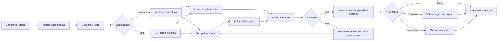

# Dia 2 — Definição do fluxo-alvo da tela de tarefas

Data: 11/08/2026  
Escopo: Lista, Kanban, detalhe, atualização e conclusão de tarefas  
Base: diagnóstico do Dia 1 e regras existentes no sistema

## Objetivo

Definir uma experiência única para localizar, abrir, editar, mover e concluir tarefas, mantendo as mesmas regras e o mesmo contexto nas visualizações Lista e Kanban.

## Princípios definidos

1. Lista e Kanban são duas apresentações da mesma consulta, dos mesmos filtros e do mesmo estado.
2. A tarefa é a fonte operacional; origem, vínculos e permissões continuam preservados.
3. Informações para decidir devem aparecer sem abrir o detalhe.
4. Alterações frequentes devem ser rápidas, mas alterações contextuais permanecem no painel lateral.
5. Toda mudança deve apresentar confirmação, erro recuperável e histórico.
6. Filtros, busca, página e tarefa aberta devem ser representáveis na URL para preservar contexto.

## Fluxo principal

## Fluxo de localização

### Entrada padrão

- abrir na última visualização usada pelo usuário;
- aplicar a visão “Minhas tarefas abertas” quando não existir preferência salva;
- não carregar tarefas arquivadas por padrão;
- ordenar tarefas por exceção: atrasadas, vencimento próximo, prioridade e criação.

### Controles sempre visíveis

- busca por título, cliente e responsável;
- visões rápidas: Minhas, Atrasadas, Hoje e Esta semana;
- botão Filtros com quantidade de filtros adicionais ativos;
- alternância Lista/Kanban;
- botão Nova tarefa;
- ação Limpar quando houver busca ou filtro ativo.

### Filtros adicionais

- status;
- setor;
- origem;
- prioridade;
- responsável;
- cliente;
- prazo inicial e final;
- competência, quando aplicável.

Todos os filtros devem ser aplicados na consulta do backend e persistidos na URL. Ao alternar Lista/Kanban, o recorte permanece intacto.

## Informações visíveis sem abrir a tarefa

### Obrigatórias no card e na linha

1. título;
2. cliente ou “Sem cliente”;
3. prazo, com indicação de atrasada/vence hoje/próxima;
4. responsável ou “Sem responsável”;
5. prioridade;
6. origem: Portal do Cliente, Obrigações ou Criação Interna;
7. setor;
8. status;
9. indicador discreto de comentários, anexos ou subtarefas somente quando houver conteúdo.

### Visíveis apenas no painel lateral

- descrição completa;
- todos os setores/tags;
- subtarefas detalhadas;
- anexos e conversa interna;
- histórico completo;
- tarefas relacionadas;
- identificadores e informações técnicas da integração;
- regras e bloqueios específicos da origem.

## Ações rápidas e ações do painel

| Ação | Card/linha | Painel lateral | Regra |
|---|---:|---:|---|
| Abrir tarefa | Sim | — | Clique no corpo, sem conflito com outros controles. |
| Alterar status | Sim | Sim | Validar transição antes de confirmar. |
| Alterar responsável | Sim | Sim | Opções limitadas ao escopo permitido. |
| Alterar prazo | Sim | Sim | Registrar valor anterior e novo no histórico. |
| Alterar prioridade | Sim | Sim | Atualizar ordenação e destaque imediatamente. |
| Editar título | Não | Sim | Evita alterações acidentais no quadro. |
| Editar descrição | Não | Sim | Campo contextual. |
| Alterar cliente/setor | Não | Sim | Pode afetar acesso e visibilidade. |
| Anexar arquivo/comentar | Não | Sim | Exige contexto e feedback de envio. |
| Excluir tarefa | Não | Sim | Somente se permitido, com confirmação e recuperação. |
| Arquivar | Não | Sim | Não deve ocorrer automaticamente durante uma leitura. |

## Comportamento do Kanban

- colunas: Backlog, A Fazer, Em Andamento, Revisão e Concluído;
- Arquivo permanece fora do fluxo principal e abre sob demanda;
- cada coluna carrega uma quantidade inicial limitada e oferece “Carregar mais”;
- o contador mostra o total da consulta, não somente os cards carregados;
- arrastar destaca destinos permitidos;
- soltar inicia salvamento e bloqueia uma segunda movimentação do mesmo card;
- sucesso mantém o card no destino e atualiza contadores;
- erro retorna o card à posição anterior e exibe mensagem acionável;
- uma coluna vazia pode ser mais compacta, mas deve continuar aceitando drop;
- tarefas de obrigação podem permanecer agrupadas no Backlog, desde que o grupo mostre competência, quantidade e vencimento.

## Comportamento da Lista

- usa exatamente a mesma consulta, filtros e ordenação do Kanban;
- colunas padrão: tarefa, cliente, prazo, responsável, prioridade, setor, origem e status;
- permite ordenação por prazo, prioridade, atualização e criação;
- usa paginação ou carregamento progressivo;
- clicar na linha abre o mesmo painel lateral do Kanban;
- mudança de visualização não perde busca, filtros, página lógica ou tarefa selecionada;
- quando não houver resultados, exibe o motivo e ações para limpar filtros ou criar tarefa.

## Painel lateral único

O mesmo componente deve atender Lista, Kanban, calendário, notificações e acessos relacionados.

### Ordem das seções

1. cabeçalho: título, cliente, origem e status;
2. campos operacionais: responsável, prazo, prioridade e setores;
3. descrição e subtarefas;
4. anexos e comunicação interna;
5. tarefas relacionadas;
6. histórico;
7. ações destrutivas ou administrativas.

### Regras de contexto

- abrir imediatamente com os dados disponíveis no card/linha;
- carregar detalhes complementares sem bloquear a abertura;
- buscar histórico, relações e responsáveis em paralelo quando independentes;
- fechar o painel sem recarregar a coleção;
- permitir URL com `task=<id>` para calendário e notificações;
- ao abrir uma tarefa não carregada na página atual, consultar diretamente pelo ID, respeitando permissão.

## Estados e transições

| Estado técnico | Nome visível | Próximos estados normais |
|---|---|---|
| `backlog` | Backlog | A Fazer, Em Andamento |
| `todo` | A Fazer | Backlog, Em Andamento |
| `doing` | Em Andamento | A Fazer, Revisão |
| `review` | Revisão | Em Andamento, Concluído |
| `done` | Concluído | Revisão, Arquivo |
| `archived` | Arquivo | Concluído |

Transições administrativas adicionais podem existir, mas devem exigir confirmação quando pularem etapas. “Atrasada” não é status gravado; é uma condição derivada do prazo de uma tarefa ainda aberta.

## Regras por origem

### Criação Interna

- segue o fluxo normal;
- criação permitida para administradores e colaboradores ativos com módulo Tarefas;
- visualização respeita setor e escopo efetivo.

### Portal do Cliente

- identificado por `request_id`;
- origem permanece visível e não pode ser alterada manualmente;
- mudanças operacionais não devem apagar o vínculo com a solicitação.

### Obrigações

- identificada por `integration_source` de obrigação ou `integration_task_id` iniciado por `instance:`;
- tarefa e instância precisam permanecer sincronizadas;
- mover para Revisão exige vínculo técnico válido;
- concluir exige documento/estado da instância compatível e passagem por Revisão, salvo instância já concluída;
- falha na sincronização impede a mudança da tarefa e mantém o estado anterior;
- prioridade, responsável e prazo técnico sincronizam com a instância quando aplicável.

## Permissões preservadas

- administrador acessa todos os setores e o Arquivo;
- colaborador ativo com módulo Tarefas acessa o próprio setor canônico;
- usuário em revisão, inativo ou sem módulo não cria nem opera tarefas;
- responsáveis disponíveis devem respeitar o setor selecionado;
- alteração de cliente/setor não pode tornar uma tarefa invisível sem aviso antes do salvamento;
- permissões devem ser aplicadas no backend/RLS e refletidas na interface, não somente filtradas no frontend.

## Tratamento de erros

| Situação | Comportamento esperado |
|---|---|
| Falha na carga inicial | Mostrar mensagem, contexto e botão Tentar novamente. |
| Nenhum resultado | Explicar filtros ativos e oferecer Limpar filtros. |
| Tarefa não encontrada | Informar remoção/inacessibilidade e retirar `task` da URL. |
| Falha ao salvar | Manter painel aberto, preservar edição e permitir tentar novamente. |
| Falha ao mover | Reverter o card e manter contadores anteriores. |
| Falha de obrigação | Mostrar a regra que bloqueou e não alterar tarefa/instância. |
| Perda de conexão | Identificar estado não sincronizado; nunca apresentar sucesso falso. |
| Conflito de atualização | Recarregar versão atual e informar quais dados mudaram. |
| Sem permissão | Bloquear controle antes da ação e explicar o motivo. |

## Decisões registradas

1. Uma única consulta e um único estado de filtros alimentarão Lista e Kanban.
2. O painel lateral será único para todos os pontos de entrada.
3. Busca e visões rápidas ficarão sempre visíveis.
4. Atraso será uma condição derivada, não uma coluna/status independente.
5. Arquivo não será carregado nem mostrado por padrão.
6. Arquivamento automático sairá do carregamento da tela e será tratado por backend agendado ou ação explícita.
7. Filtros, visualização e tarefa selecionada serão persistidos na URL/preferência.
8. Paginação e filtros ocorrerão no backend.
9. Relações entre tarefas continuarão informativas e não bloquearão conclusão.
10. Regras de obrigação permanecem obrigatórias em todas as formas de atualização.

## Itens fora do escopo desta sprint

- reformulação completa do cadastro de clientes;
- alteração das regras de geração de obrigações;
- criação de novos status personalizados;
- automações de SLA ou escalonamento;
- relatórios gerenciais avançados;
- substituição do sistema de permissões;
- aplicativo móvel nativo;
- redesenho integral de comentários e anexos fora do painel da tarefa.

## Sequência de implementação aprovada para os próximos dias

1. consulta compartilhada e contrato único de tarefa;
2. busca, filtros e URL compartilhados;
3. visões rápidas;
4. cards e colunas;
5. painel lateral único;
6. ações rápidas e movimentação segura;
7. Lista compartilhando a mesma fonte;
8. paginação, cache e performance;
9. acessibilidade e validação final.

## Critérios de aceite do Dia 2

- [x] Fluxo cobre entrada, localização, abertura, edição, movimentação, conclusão e erros.
- [x] Regras de permissões, origens, obrigações, histórico e vínculos foram preservadas.
- [ ] Produto e representantes da operação aprovam o fluxo.

O terceiro critério requer validação humana. A recomendação é realizar uma revisão de 30 minutos usando os três fluxos do Dia 1 e registrar apenas divergências que alterem regra, informação visível ou ordem de execução.

## Implementação executada no Dia 2

A fundação de navegação do fluxo foi aplicada:

- a tarefa aberta passa a ser persistida na URL como `task=<id>`;
- Lista e Kanban reconhecem o mesmo parâmetro e abrem a tarefa correspondente;
- alternar entre Lista e Kanban preserva a tarefa selecionada;
- fechar o painel remove somente o parâmetro da tarefa, preservando a visualização e os demais filtros;
- abrir uma tarefa relacionada atualiza o mesmo contexto;
- excluir a tarefa ou iniciar a criação de uma relacionada limpa o contexto anterior;
- iniciar uma nova tarefa pelo cabeçalho remove a tarefa selecionada antes de abrir o cadastro;
- tarefa inexistente ou inacessível na Lista apresenta erro e limpa o parâmetro inválido.

Foi criado teste automatizado para inclusão, substituição e remoção do parâmetro sem perda dos demais parâmetros da URL.

As mudanças visuais, filtros compartilhados, consulta paginada e painel lateral único continuam distribuídos nos próximos dias da sprint, evitando concentrar uma reformulação de alto risco em uma única entrega.
