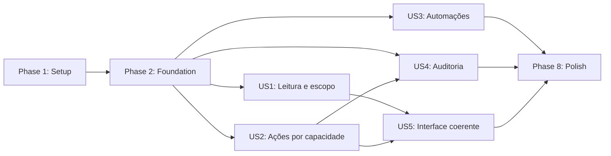

# Tasks: Revisão das permissões de tarefas

**Input**: artefatos de `specs/012-review-task-permissions/`

**Prerequisites**: `plan.md`, `spec.md`, `research.md`, `data-model.md`, `contracts/`, `quickstart.md`

**Tests**: obrigatórios. A especificação exige matriz automatizada com pelo menos 100 cenários, testes negativos, isolamento entre organizações e validação das automações privilegiadas.

**Organization**: as tarefas estão agrupadas por história de usuário e ordenadas para permitir entregas independentes após a fundação de segurança.

## Formato: `[ID] [P?] [Story] Descrição`

- **[P]**: pode ser executada em paralelo porque atua em arquivo diferente e não depende de tarefa incompleta.
- **[USn]**: relaciona a tarefa à história de usuário correspondente.
- Cada descrição contém o caminho exato do arquivo principal afetado.

## Phase 1: Setup (Shared Infrastructure)

**Purpose**: preparar evidências, contratos executáveis e pontos de entrada sem alterar ainda o comportamento produtivo.

- [X] T001 Registrar o inventário inicial de policies, grants, funções `SECURITY DEFINER`, escritores de `kanban_tasks` e divergências legado/canônico em `specs/012-review-task-permissions/evidence/security-baseline.md`
- [X] T002 [P] Criar fixtures reutilizáveis para organizações, papéis, módulos, setores, usuários suspensos e tarefas cruzadas em `supabase/tests/task_permissions_test_helpers.sql`
- [X] T003 [P] Criar a enumeração TypeScript das capacidades descritas no contrato em `src/lib/taskPermissions.ts`
- [X] T004 [P] Criar os tipos Deno de ator humano, ator de sistema, decisão e contexto de tarefa em `supabase/functions/_shared/task-authorization.ts`
- [X] T005 [P] Configurar a nova função com verificação obrigatória de JWT em `supabase/config.toml`
- [X] T006 Documentar feature flags, shadow mode, sequência de rollout, métricas e responsáveis operacionais em `specs/012-review-task-permissions/evidence/rollout-runbook.md`

---

## Phase 2: Foundational (Blocking Prerequisites)

**Purpose**: conter as falhas críticas e estabelecer a única fronteira de autorização/mutação usada pelas histórias.

**⚠️ CRITICAL**: nenhuma história pode entrar em implementação antes da conclusão desta fase.

- [X] T007 [P] Escrever testes pgTAP que detectem policies sobrepostas, grants globais proibidos e execução pública de helpers privilegiados em `supabase/tests/task_permissions_grants.sql`
- [X] T008 [P] Escrever testes pgTAP básicos de isolamento organizacional e negação por estado de acesso em `supabase/tests/task_permissions_rls.sql`
- [X] T009 Criar via `supabase migration new harden_task_permissions` e implementar a contenção que remove DELETE legado, revoga `TRUNCATE`/`TRIGGER`/`REFERENCES` e revoga execução `PUBLIC`/`anon` de helpers privilegiados em `supabase/migrations/*_harden_task_permissions.sql`
- [X] T010 Implementar no mesmo arquivo a função SQL privada de decisão por capacidade, baseada exclusivamente em acesso organizacional canônico, módulo, setor, papel e estado da tarefa em `supabase/migrations/*_harden_task_permissions.sql`
- [X] T011 Implementar no mesmo arquivo a operação transacional service-role-only que bloqueia a linha, revalida capacidade, aplica allowlist de campos e grava auditoria atômica em `supabase/migrations/*_harden_task_permissions.sql`
- [X] T012 Implementar o avaliador Deno compartilhado com negação por padrão, validação de tenant e distinção entre ator delegado e ator de sistema em `supabase/functions/_shared/task-authorization.ts`
- [X] T013 Criar o endpoint canônico, schemas Zod, autenticação, correlação e respostas seguras em `supabase/functions/task-actions/index.ts`
- [X] T014 [P] Criar testes Deno do endpoint para JWT ausente, tenant divergente, ação inválida e resposta sem vazamento de dados em `supabase/functions/task-actions/index.test.ts`
- [X] T015 Criar o cliente único de mutações humanas via `supabase.functions.invoke('task-actions')`, com tipos discriminados de sucesso/negação/conflito em `src/lib/taskActions.ts`
- [X] T016 Atualizar os tipos gerados após a migração e garantir que as novas funções não sejam expostas a `anon`/`authenticated` em `src/integrations/supabase/types.ts`

**Checkpoint**: contenção ativa, decisão canônica disponível e mutação sensível executável apenas pela fronteira backend.

---

## Phase 3: User Story 1 — Acesso mínimo e previsível às tarefas (Priority: P1) 🎯 MVP

**Goal**: garantir que todo acesso de leitura respeite organização, estado de acesso, módulo e setor, inclusive por identificador conhecido.

**Independent Test**: simular administrador, colaborador, suspenso e usuário de outra organização em Kanban, Lista, Calendário e URL direta; nenhum recurso fora do escopo pode ser lido.

### Tests for User Story 1

- [X] T017 [P] [US1] Expandir a matriz pgTAP de SELECT para papel, organização, módulo, setor, estados suspenso/inativo/em revisão, comentários e relações em `supabase/tests/task_permissions_rls.sql`
- [X] T018 [P] [US1] Escrever testes unitários da decisão de leitura e normalização de setores legados em `src/test/taskPermissions.test.ts`
- [X] T019 [P] [US1] Escrever testes de acesso direto, cache após troca de organização e revogação durante sessão em `src/test/taskAccessEntries.test.tsx`

### Implementation for User Story 1

- [X] T020 [US1] Substituir as policies de SELECT de tarefas, comentários e relações pela decisão canônica e adicionar índices de tenant/setor/status/responsável em `supabase/migrations/*_harden_task_permissions.sql`
- [X] T021 [US1] Implementar em `src/lib/taskPermissions.ts` a derivação pura de `task.read` para apresentação, sem fallback de papel legado e sem substituir a decisão backend
- [X] T022 [US1] Reduzir `src/lib/taskSectorAccess.ts` a um adaptador temporário da matriz canônica e remover normalizações divergentes de setor
- [ ] T023 [US1] Fazer consultas do quadro enviarem organização e filtros ao servidor, com chave TanStack Query segregada por tenant e sem filtragem de segurança no cliente em `src/pages/KanbanPage.tsx`
- [X] T024 [P] [US1] Aplicar consulta escopada e tratamento indistinguível de inexistente/não autorizado à lista em `src/pages/TarefasPage.tsx`
- [X] T025 [P] [US1] Aplicar consulta escopada e tratamento indistinguível de inexistente/não autorizado ao calendário em `src/pages/CalendarioPage.tsx`

**Checkpoint**: a leitura fica protegida e testável de forma independente em todas as entradas principais.

---

## Phase 4: User Story 2 — Ações compatíveis com responsabilidade e papel (Priority: P1)

**Goal**: separar criação, conteúdo, status, atribuição, setor, cliente, subtarefas, comentário, relação, arquivo e exclusão em capacidades explícitas.

**Independent Test**: executar cada ação como administrador e colaborador por endpoint direto e pela interface, incluindo mudanças simultâneas de campos e criação intersetorial.

### Tests for User Story 2

- [X] T026 [P] [US2] Criar testes pgTAP para allowlist de campos, transições, operações em lote, concorrência e rollback integral em `supabase/tests/task_permissions_mutations.sql`
- [ ] T027 [P] [US2] Criar testes de contrato Deno para todas as ações definidas em `contracts/task-mutation-contract.md` em `supabase/functions/task-actions/index.test.ts`
- [X] T028 [P] [US2] Criar testes Vitest da matriz administrador/colaborador e dos campos sensíveis em `src/test/taskPermissions.test.ts`

### Implementation for User Story 2

- [X] T029 [US2] Completar a operação SQL canônica com coluna de versão, limite de 100 itens, lote all-or-nothing, transições e proteção contra troca implícita de tenant em `supabase/migrations/*_harden_task_permissions.sql`
- [X] T030 [US2] Completar o roteamento de `create`, `update_content`, `change_status`, `assign`, `change_sector`, `change_client`, `archive`, exclusão lógica e restauração em `supabase/functions/task-actions/index.ts`
- [ ] T031 [US2] Implementar confirmação, setor/responsável válidos e auditoria para criação intersetorial que pode ficar invisível ao criador em `supabase/functions/task-actions/index.ts`
- [ ] T032 [US2] Migrar criação, edição, movimentação, conclusão e arquivamento do quadro para `src/lib/taskActions.ts` em `src/pages/KanbanPage.tsx`
- [ ] T033 [P] [US2] Migrar edição de conteúdo, atribuição, setor, cliente, subtarefas, comentários e relações para o contrato canônico em `src/components/app/KanbanTaskDetailSheet.tsx`
- [ ] T034 [P] [US2] Migrar ações equivalentes da visualização de lista para o contrato canônico em `src/pages/TarefasPage.tsx`
- [ ] T035 [US2] Remover UPDATE/DELETE diretos sensíveis de `authenticated`, preservando somente caminhos explicitamente justificados por RLS, em `supabase/migrations/*_harden_task_permissions.sql`

**Checkpoint**: cada ação possui uma capacidade, uma validação backend e um resultado auditável, sem depender do botão exibido.

---

## Phase 5: User Story 3 — Automações obedecem às mesmas fronteiras (Priority: P1)

**Goal**: impedir que WhatsApp, obrigações, Acessórias e outros escritores privilegiados contornem a autorização da tarefa.

**Independent Test**: invocar cada automação com tenant/tarefa/setor/cliente válidos e inválidos, repetir o evento e verificar autorização anterior à mutação, falha fechada e ausência de duplicação.

### Tests for User Story 3

- [ ] T036 [P] [US3] Criar testes Deno do helper para ator delegado, ator de sistema allowlisted, vínculo técnico e idempotência em `supabase/functions/_shared/task-authorization.test.ts`
- [ ] T037 [P] [US3] Criar matriz ponta a ponta de automações válidas, cruzadas, repetidas e parcialmente falhas em `supabase/functions/_shared/task-integrations.test.ts`

### Implementation for User Story 3

- [ ] T038 [US3] Finalizar `authorizeDelegatedTaskAction` e `authorizeSystemTaskAction` com correlação, allowlist de origem e prova de vínculo técnico em `supabase/functions/_shared/task-authorization.ts`
- [ ] T039 [P] [US3] Revalidar capacidade na conclusão de ticket e impedir sucesso parcial entre ticket e tarefa em `supabase/functions/whatsapp-ticket-actions/index.ts`
- [ ] T040 [P] [US3] Migrar escritas e vínculos de tarefa do envio de mensagem para o helper canônico em `supabase/functions/whatsapp-send-message/index.ts`
- [ ] T041 [P] [US3] Migrar criação, revisão e conclusão de tarefas de obrigações com chave idempotente em `supabase/functions/grow-obligations-module/index.ts`
- [ ] T042 [P] [US3] Migrar criação e sincronização de tarefas das Acessórias com validação de organização/cliente/setor em `supabase/functions/acessorias-module/index.ts`
- [ ] T043 [US3] Inventariar e corrigir os escritores restantes encontrados no baseline, registrando arquivo, origem, ator e estratégia adotada em `specs/012-review-task-permissions/evidence/task-writers-migration.md`

**Checkpoint**: nenhum fluxo privilegiado altera uma tarefa sem decisão explícita para o recurso ou identidade técnica idempotente.

---

## Phase 6: User Story 4 — Auditoria confiável e centralizada (Priority: P2)

**Goal**: registrar sucesso, falha e negações de alto risco com ator, origem, correlação e valores antes/depois, sem falso positivo.

**Independent Test**: alterar e tentar alterar tarefas por UI e automação, consultar em outra sessão e confirmar atomicidade, imutabilidade e ausência de conteúdo sigiloso em eventos negados.

### Tests for User Story 4

- [X] T044 [P] [US4] Criar testes pgTAP de atomicidade, imutabilidade, RLS e ausência de auditoria de sucesso após rollback em `supabase/tests/task_permissions_audit.sql`
- [ ] T045 [P] [US4] Criar testes Deno para auditoria de negações de alto risco sem revelar título, cliente ou conteúdo da tarefa em `supabase/functions/task-actions/index.test.ts`

### Implementation for User Story 4

- [ ] T046 [US4] Completar o payload atômico de auditoria com before/after, campos alterados, ator, origem, resultado, correlação e idempotência em `supabase/migrations/*_harden_task_permissions.sql`
- [ ] T047 [US4] Implementar registro seguro de negações e falhas fora da transação revertida, sem aceitar identidade arbitrária do chamador, em `supabase/functions/task-actions/index.ts`
- [ ] T048 [US4] Converter `src/lib/changeHistory.ts` em leitura do histórico central e remover gravações best-effort das ações cobertas
- [ ] T049 [US4] Aplicar RLS e índices de consulta ao histórico por organização, tarefa, ação, origem e correlação em `supabase/migrations/*_harden_task_permissions.sql`

**Checkpoint**: toda ação sensível concluída possui exatamente um evento correspondente e falhas nunca aparecem como sucesso.

---

## Phase 7: User Story 5 — Permissões compreensíveis na interface (Priority: P2)

**Goal**: apresentar a mesma decisão de capacidade em Kanban, Lista, Calendário, detalhe, notificações e links diretos, reagindo a revogações.

**Independent Test**: comparar todas as entradas com os mesmos perfis; ações indisponíveis não aparecem e uma revogação é refletida na próxima tentativa e em até 60 segundos.

### Tests for User Story 5

- [ ] T050 [P] [US5] Criar testes de componentes para visibilidade das ações, explicação acessível, erro de revogação e consistência entre entradas em `src/test/taskPermissionUi.test.tsx`
- [ ] T051 [P] [US5] Criar teste de cache segregado por organização e invalidação após mutação/revogação em `src/test/taskPermissionCache.test.tsx`

### Implementation for User Story 5

- [ ] T052 [US5] Expor helpers estáveis de visibilidade, motivo de bloqueio e mapeamento de resposta backend em `src/lib/taskPermissions.ts`
- [ ] T053 [US5] Aplicar capacidades aos menus, atalhos, drag-and-drop e ações em lote do quadro em `src/pages/KanbanPage.tsx`
- [ ] T054 [P] [US5] Aplicar capacidades e mensagens equivalentes ao painel lateral em `src/components/app/KanbanTaskDetailSheet.tsx`
- [ ] T055 [P] [US5] Aplicar capacidades às ações da Lista e Workspace em `src/pages/TarefasPage.tsx` e `src/pages/TaskWorkspacePage.tsx`
- [ ] T056 [P] [US5] Aplicar capacidades ao Calendário e impedir abertura residual por evento conhecido em `src/pages/CalendarioPage.tsx`
- [ ] T057 [US5] Invalidar queries de tarefa/capacidades por tenant após negação, mudança de organização e revogação, usando janela máxima de 60 segundos, em `src/lib/taskActions.ts`

**Checkpoint**: a interface é coerente, mas continua sendo apenas representação da decisão backend.

---

## Phase 8: Polish & Cross-Cutting Concerns

**Purpose**: desligar compatibilidade legada com segurança, validar escala e executar os gates finais.

- [ ] T058 Gerar relatório de usuários dependentes de papel legado e plano de backfill sem ampliação de acesso em `specs/012-review-task-permissions/evidence/legacy-access-report.md`
- [ ] T059 Implementar shadow comparison, métricas de divergência e depois remoção controlada do fallback legado em `supabase/migrations/*_harden_task_permissions.sql`
- [ ] T060 [P] Criar seed e roteiro de medição com 10.000 tarefas, incluindo `EXPLAIN (ANALYZE, BUFFERS)` dos filtros principais e expurgo auditado após retenção de um ano, em `supabase/tests/task_permissions_performance.sql`
- [ ] T061 Consolidar ao menos 100 cenários positivos e negativos, eliminando lacunas da matriz papel × estado × tenant × setor × ação × entrada em `specs/012-review-task-permissions/evidence/scenario-matrix.md`
- [ ] T062 Executar pgTAP, testes Deno, advisors Supabase e registrar resultados/achados remanescentes em `specs/012-review-task-permissions/evidence/security-verification.md`
- [ ] T063 Executar `npm run lint`, `npm run test`, `npm run build` e `npm run verify:deploy`, registrando resultados em `specs/012-review-task-permissions/evidence/application-verification.md`
- [ ] T064 Validar ponta a ponta o roteiro de `quickstart.md`, rollback sem reabrir grants inseguros e critérios SC-001 a SC-008 em `specs/012-review-task-permissions/evidence/release-acceptance.md`

---

## Dependencies & Execution Order

### Phase Dependencies

- **Phase 1 — Setup**: sem dependências.
- **Phase 2 — Foundational**: depende da Phase 1 e bloqueia todas as histórias.
- **US1, US2 e US3 (P1)**: dependem da Phase 2. Podem avançar em paralelo depois que o contrato canônico estiver estável; US2 e US3 reutilizam a decisão fundada, não a UI de US1.
- **US4 (P2)**: depende da operação transacional da Phase 2 e deve estar concluída antes do rollout de enforcement.
- **US5 (P2)**: depende do formato estável de capacidades e respostas de US1/US2; pode avançar em paralelo com US3/US4 após esses contratos.
- **Phase 8 — Polish**: depende das histórias selecionadas para release; T059 só executa a remoção do fallback após shadow mode sem divergências críticas.

### User Story Dependency Graph



### Within Each User Story

- Escrever os testes indicados primeiro e confirmar a falha esperada.
- Implementar decisão/regras backend antes de migrar consumidores.
- Validar a história isoladamente no checkpoint antes do enforcement seguinte.
- Não remover o fallback legado antes do inventário, backfill e shadow comparison.

### Parallel Opportunities

- T002–T005 podem avançar em paralelo.
- T007 e T008 podem avançar em paralelo antes da migração.
- Os testes de cada história marcados [P] podem ser escritos simultaneamente.
- Após a fundação, US1, US2 e US3 podem ser divididas entre frentes distintas com coordenação do contrato.
- Migrações das integrações T039–T042 atuam em funções diferentes e podem avançar em paralelo.
- As superfícies de UI T054–T056 atuam em arquivos diferentes e podem avançar em paralelo.

## Parallel Examples

### User Story 1

```text
T017 — matriz pgTAP de leitura em supabase/tests/task_permissions_rls.sql
T018 — matriz TypeScript em src/test/taskPermissions.test.ts
T019 — entradas e revogação em src/test/taskAccessEntries.test.tsx
```

### User Story 2

```text
T026 — mutações SQL
T027 — contrato da Edge Function
T028 — capacidades do frontend
```

### User Story 3

```text
T039 — WhatsApp ticket
T040 — WhatsApp mensagem
T041 — Obrigações
T042 — Acessórias
```

### User Story 5

```text
T054 — detalhe
T055 — lista/workspace
T056 — calendário
```

## Implementation Strategy

### MVP First

1. Concluir Setup e Foundational.
2. Entregar US1 para fechar exposição por leitura e identificador conhecido.
3. Entregar US2 para fechar alterações sensíveis.
4. Validar isoladamente a matriz P1 antes de ativar enforcement amplo.

### Incremental Delivery

1. **Contenção**: T001–T016 elimina riscos críticos sem depender da nova UX.
2. **MVP de acesso**: US1 garante isolamento e entradas seguras.
3. **MVP operacional**: US2 centraliza ações humanas.
4. **Paridade de integrações**: US3 fecha bypasses privilegiados.
5. **Confiabilidade**: US4 torna a evidência atômica.
6. **Experiência**: US5 alinha todas as superfícies.
7. **Enforcement final**: Phase 8 remove o legado somente após evidências.

## Notes

- `[P]` pressupõe arquivos distintos e contratos já definidos; tarefas no mesmo arquivo devem ser serializadas.
- Nenhuma filtragem no frontend é controle de segurança.
- Mutações de tarefa e auditoria sensível devem compartilhar a mesma transação.
- Operações de sistema exigem origem allowlisted, tenant e vínculo técnico idempotente; service role isoladamente não concede regra de negócio.
- Commits devem ser feitos por tarefa ou grupo lógico após os testes correspondentes passarem.
